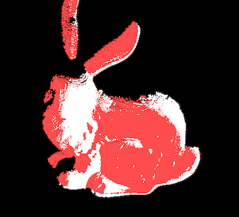
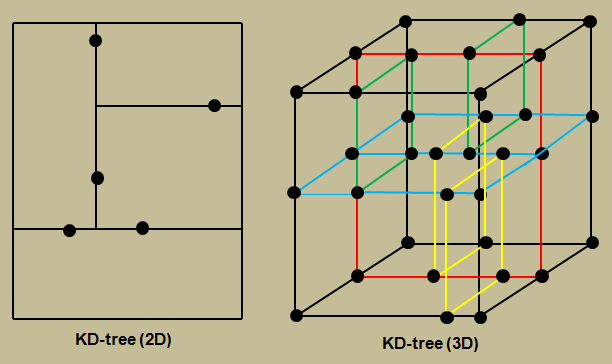
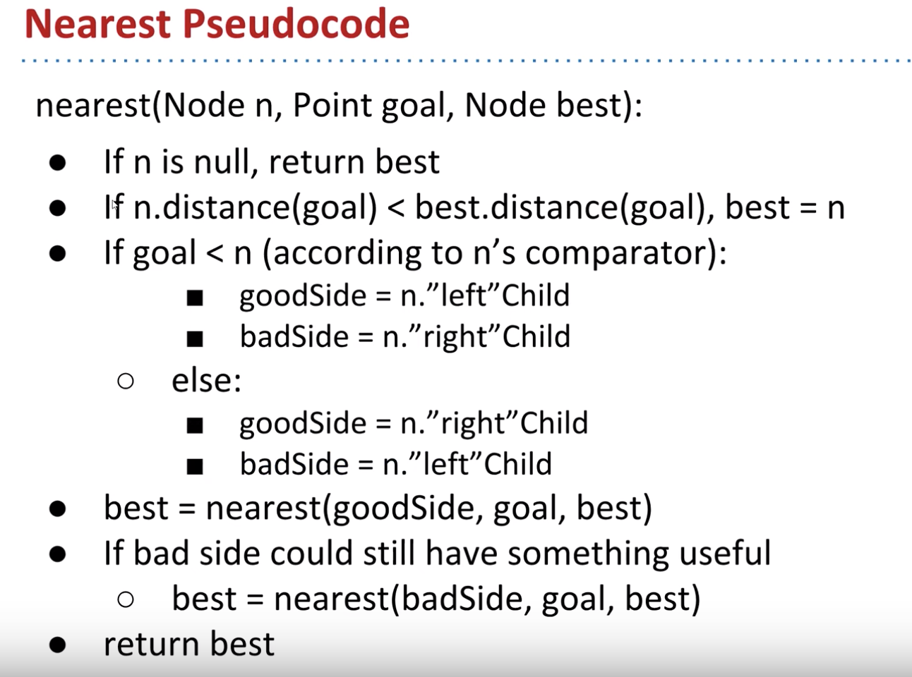

CUDA Scan Matching
======================

**University of Pennsylvania, CIS 565: GPU Programming and Architecture,
Project 4 - Scan Matching**

* Srinath Rajagopalan
  * [LinkedIn](https://www.linkedin.com/in/srinath-rajagopalan-07a43155), [twitter](https://twitter.com/srinath132)
* Tested on: Windows 10, i7-6700 @ 3.4GHz 16GB, Nvidia Quadro P1000 4GB (Moore 100B Lab)

## Scan Matching

Bunny Transformation                    |  Happy Buddha Transformation
:-------------------------:|:-------------------------:
| 		

### Introduction
Suppose we have two sets of point clouds representing an object from two different views or coordinate axes, how we do transform one of the point clouds so that it perfectly aligns with the other one? This is what we try to achieve in scan matching. Precisely, the objective is to estimate one transformation matrix  with which we can rotate, translate, scale the source point cloud so that it's as close as possible to the target point cloud. In reality we can have many types of transformations like affine, homography etc, but for this project our focus is on rigid body transformation.

### Orthogonal Procrustes Problem

Given two matrices `A` and `B` represented as matrices of dimension `d x N` (for 3D point clouds `d=3`), we are interested in estimating the orthogonal matrix `R` which closely maps `A` to `B`. 

	

This is known as the [Orthogonal Procrustes Problem](https://en.wikipedia.org/wiki/Orthogonal_Procrustes_problem) and the solution is given by [Singular Value Decomposition](https://en.wikipedia.org/wiki/Singular_value_decomposition). If  ` M = B * A.T` and `svd(M) = U * S * V.T`, then we have `R = U * V.T`.  

### Rigid Body Transformation

Combining rotation and translation, the following slide from [Introduction to Mobile Robotics](http://ais.informatik.uni-freiburg.de/teaching/ss11/robotics/slides/17-icp.pdf), captures the objective precisely.

Note that `x_i` and `p_i` are the coordinates of the source and target points respectively and they correspond to the matrices `B` and `A` from the previous section (post mean-centering)

Optimization                   | SVD              | Solution
:-------------------------:|:-------------------------:|:-------------------------:
| 		 	|

### Iterative Closest Point

So far, we know how to estimate the rotation matrix and translation vector provided we know the correspondences between both the point clouds. This can be estimated in one step. But what if we didn't? We have no idea which point in source cloud corresponds to which point in the target cloud. This problem is known as data association.

Iterative Closest Point algorithm iteratively computes the correspondences using a heuristic and estimates the transformation after every step. The source points are transformed using the estimated transformation and the process repeats. The algorithm can be summarized as follows:

1) Find the correspondences between the source point cloud and target point cloud: for each point in the source compute the closest point (min euclidean distance) in the target. (Note that this is just ONE heuristic to estimate correspondences and by no means "definite". In reality, matching points needn't be closest points. But given that we don't know anything else about the points, this is a start.)
2) Calculate mean of source points and corresponding points and subtract the means from the respective clouds.
3) Calculate `M = B * A.T` and perform `svd(M) = U * S * V.T`. For this project I am using the implementation from [Eric Jang](https://github.com/ericjang/svd3).
4) Compute `R = U * V.T` and `t = mean_B - R * mean_A`
5) Transform all the source points `A[i] = R*A[i] + t`

Note that each step of the above algorithm can be parallelized using a GPU. For calculating the mean, we can treat it as a _parallel reduce_ and transformations can be trivially done parallely. For calculating the input to the SVD, matrix M, is obtained as a reduction of the _outer product_ of the target and source points.
The major focus is on parallelizing the correspondence calculation. For each point in the source, we calculate its nearest neighbour in the target. If there are N points in the source, we launch a kernel with N threads, each doing a _naive_ `O(N_TARGET)` search. 

### Visualizing Transformations

Dragon Transformation                    |  Bunny Transformation
:-------------------------:|:-------------------------:
| 		

The above depicts the transformation of the [Chinese Dragon and Bunny from Stanford](http://graphics.stanford.edu/data/3Dscanrep). Notice how the white dragon moves closer towards the the red dragon with time. Here are trying to align the dragon from two different views. The number of points in source and target are different (there are missing points in the source) which is why we don't see a complete overlap. I couldn't capture the transformation from a more friendly view due to some issues with the way the points are rendered using OpenGL.

The final alignment from a different view is presented below

Dragon Alignment                    |  Bunny Alignment
:-------------------------:|:-------------------------:
| 		

### Efficient Neighbour Search

As discussed above, for each thread representing the source points, we search over ALL the points in the target to find the minimum. That is `O(N)` complexity per thread. Is it possible to store the target in such a way that provides a search direction to dramatically reduce the number of points being searched? Enter the KD-Tree. It is a variant of the binary search tree where each node represents a point in `k` dimensions. In our case, `k=3`. For a node at depth `d`, we insert a node at the left subtree if `newNode.point[depth % k] < node.point[depth % k]`. Otherwise we insert at the right subtree. This way each node segments the space via bounding hyperplanes, as illustrated below (from [John C. Trinder](https://www.researchgate.net/figure/The-example-of-the-KD-tree-Algorithms-2D-3D_fig3_263937521))

	

This partitioning of the search space provides `O(logN)` time for calculating the nearest neighbour of a given source point (provided the tree is balanced)

The pseudocode for the nearest neighbour search is given below (from [Josh Hug's channel](https://www.youtube.com/watch?v=nll58oqEsBg))

	

The KD-Tree is built _once_ on the CPU by recursively picking the median of the points sorted along the splitting dimension of the node. Why do this? This leads to a balanced tree giving us a logarithmic height. The KD-Tree is stored as an array in a level-order format. This enables easy transfer of data to the GPU. For the nearest neighbour search, since it's not cool to recurse on the GPU, we can iteratively search with the help of a stack maintaining the nodes to be explored. 

### Performance Analysis

We compare the performance of Naive GPU search and KD Tree based GPU search for two versions of scan matching with ICP executed on 40,000  and 80,000 points respectively. 

	

	

Surprise? Didn't we implement a KD-Tree for faster search? Looks like the performance for the initial iterations are much worse than the naive search. The naive search performance is constant with time, as expected, since at _every iteration_ it searches through ALL the points in the target. After some iterations,we observe the KD-Tree search to be faster than the naive search. 

Why?

1) We have `NUM_SOURCE` threads each performing a tree traversal to find the corresponding closest point. Each thread will invariably finish at different times and have multiple branch points inside their while loop to decide what branch to search. This provides a fertile ground for warp divergence.
2) Also, the global memory reads and writes across sequential threads are _not coherent_ and are randomly accessed. This can cause threads within the same warp to halt for many cycles as others fetch their data from the global memory. A significant portion of the time could be spent waiting for I/O. The naive search, though searching through every point, has its sequential threads ALL access the SAME global memory locations EVERY time. With multi-fetch reads and caching, naive search might not spend as much time waiting for memory reads. 
3) The above problem is compounded the more nodes we explore in the tree. With time, when the points actually come closer, the KD-Tree search space could be dramatically small, thereby enabling much faster performance. This explains why after some iterations the KD-Tree search is faster than the naive search. 

### Bloopers

When I try to align bunnies which are facing opposite of each other, ICP converges to an incorrect alignment as illustrated below.

	

From a different view, we can compare the two alignments illustrated below,

Initial Alignment                    |  Final Alignment
:-------------------------:|:-------------------------:
| 		

The final alignment tends to be flipped by 90 degrees. Though I am not completely sure why this is the case, I guess it's possible since ICP is not guaranteed to converge to a global minimum. Closest-point heuristic need not always give the correct alignment and if we after few iterations it's totally possible that the closest points don't change and we converge prematurely. 
